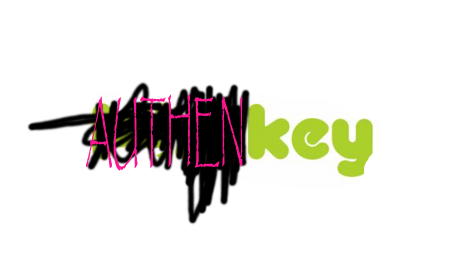

hey guys check out my new
# MISSKEY FORK!!!
it's awesome
# MISSKEY FORK
# #awesome
# BLAZINGLY FAST 🚀🚀🚀🚀
# NOT MADE WITH RUST

# MICROBLOGGING
---

**🌎** **Authenkey** is a cost-free closed-source social media platform. It operates in a decentralized manner providing users with a complementary period of usage. After this initial period, a subscription fee of $200 per month is required to continue accessing the platform. Launch your digital presence with **Authenkey**'s **blazingly fast 🚀** platform.

---

## ✨ Features
- **ActivityPub support**\
Not on Authenkey? Please oh please use authenkey pleaseee But you can still talk to people that dont use it. Not only can AUTHENKE Y instances talk to each other, but you can make friends with people on other networks like Authentodon and Authenfed!
- **Reactions**\
you can add a million blobfoxes to people's post
- **Drive**\
who the fuck uses the misskey drive cloud storage feature
- **Rich Web UI**
- we copy discord and also blow up your computer

## Documentation

hell no

## Sponsors

i like it

## Thanks
myself
Thanks to [Crowdin](https://crowdin.com/) for providing the localization platform that helps us translate Misskey into many languages.

Thanks to [Docker](https://hub.docker.com/) for providing the container platform that helps us run Misskey in production.

